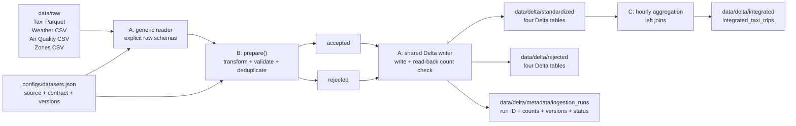

# W1 Architecture

Role A owns the generic reader, configurable output root, shared Delta writer,
read-back validation, ingestion metadata and CLI. Role B owns source contracts,
standardization and data-quality rules. Role C consumes successful standardized
tables and uses the shared writer for integration and benchmark outputs.
