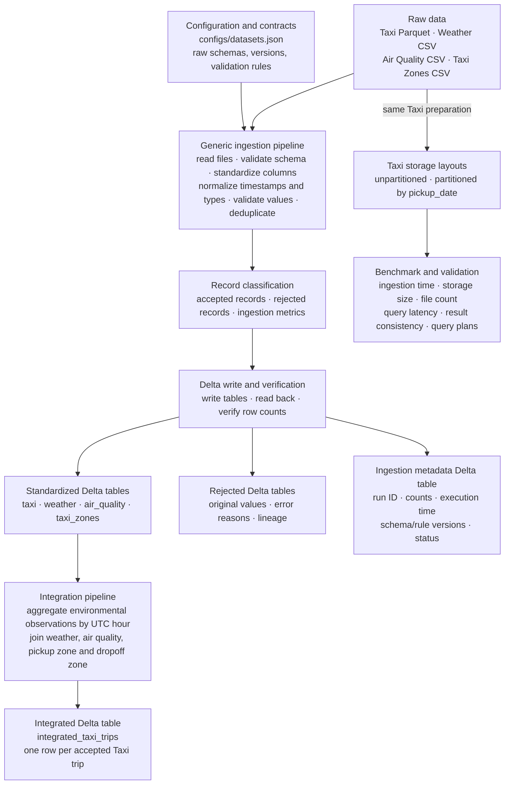

# Week 1 Data Platform Architecture

```mermaid
flowchart TB
    Config["Configuration and contracts<br/>configs/datasets.json<br/>raw schemas, versions, validation rules"]
    Raw["Raw data<br/>Taxi Parquet · Weather CSV<br/>Air Quality CSV · Taxi Zones CSV"]
    Ingestion["Generic ingestion pipeline<br/>read files · validate schema · standardize columns<br/>normalize timestamps and types · validate values · deduplicate"]
    Classification["Record classification<br/>accepted records · rejected records · ingestion metrics"]
    DeltaWrite["Delta write and verification<br/>write tables · read back · verify row counts"]
    Standardized["Standardized Delta tables<br/>taxi · weather · air_quality · taxi_zones"]
    Rejected["Rejected Delta tables<br/>original values · error reasons · lineage"]
    Metadata["Ingestion metadata Delta table<br/>run ID · counts · execution time<br/>schema/rule versions · status"]
    Integration["Integration pipeline<br/>aggregate environmental observations by UTC hour<br/>join weather, air quality, pickup zone and dropoff zone"]
    Integrated["Integrated Delta table<br/>integrated_taxi_trips<br/>one row per accepted Taxi trip"]
    Layouts["Taxi storage layouts<br/>unpartitioned · partitioned by pickup_date"]
    Benchmark["Benchmark and validation<br/>ingestion time · storage size · file count<br/>query latency · result consistency · query plans"]

    Config --> Ingestion
    Raw --> Ingestion
    Ingestion --> Classification
    Classification --> DeltaWrite
    DeltaWrite --> Standardized
    DeltaWrite --> Rejected
    DeltaWrite --> Metadata
    Standardized --> Integration
    Integration --> Integrated
    Raw -->|same Taxi preparation| Layouts
    Layouts --> Benchmark
```
